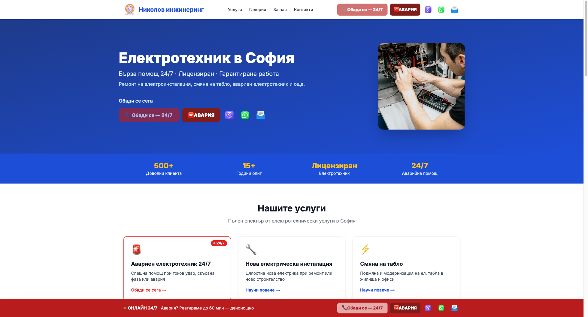
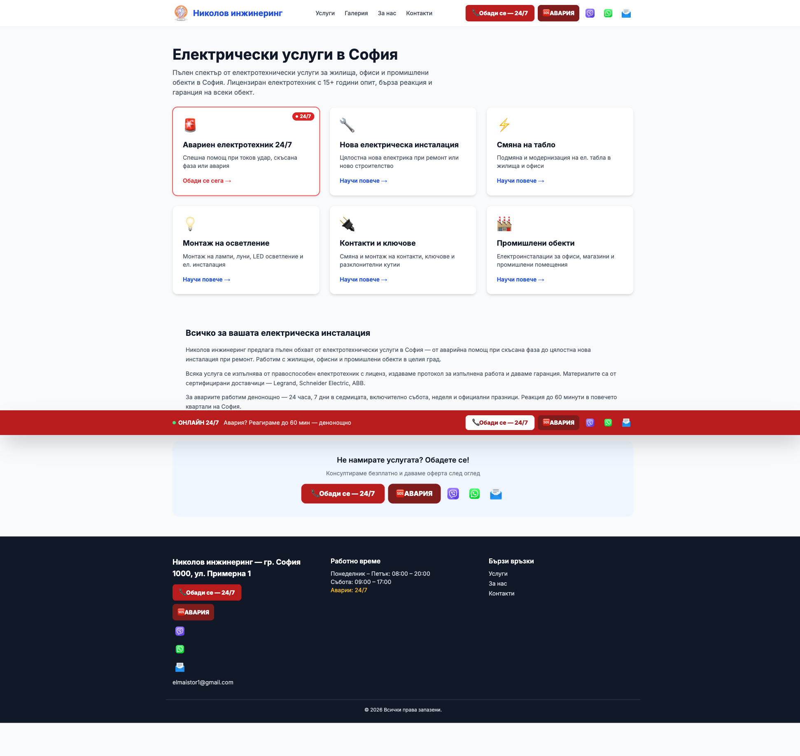
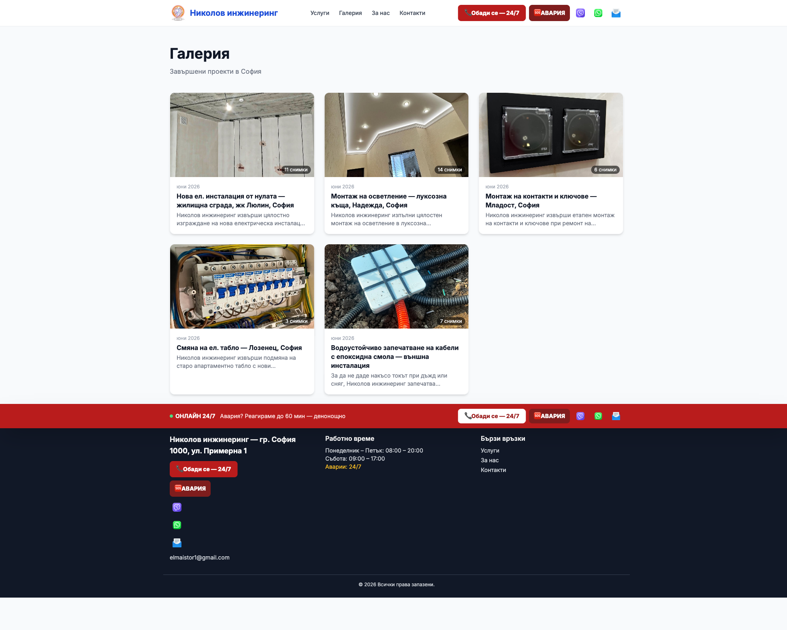
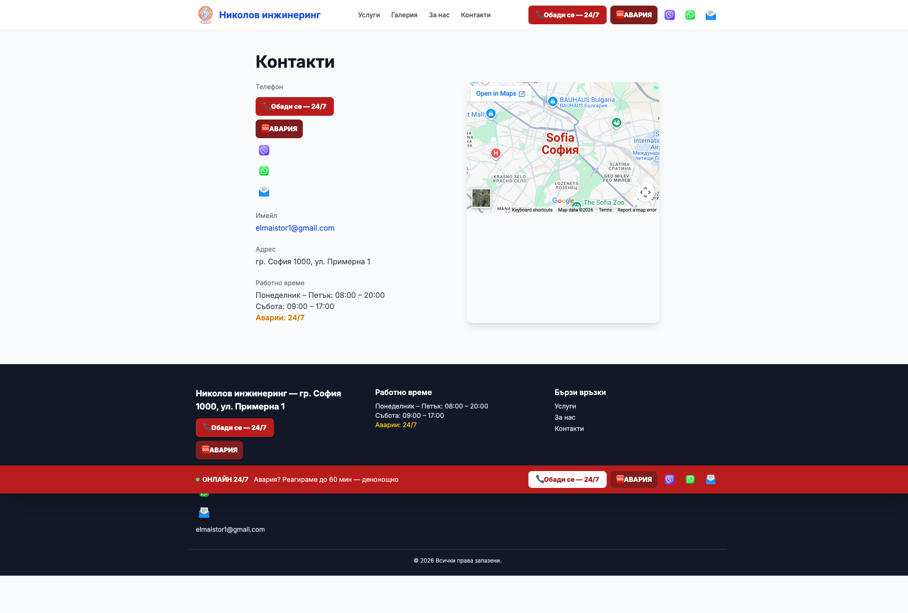

# Ръководство за редактиране на сайта

Всичко важно се редактира само в JSON файловете в папка `content/` — **без да пипаш код**.
Промените се правят директно в браузъра през GitHub — без инсталации, без команди.

---

## Как се редактира файл в GitHub

1. Отиди на **https://github.com/tlk0s/elektroSofia**
2. Влез в папка `content/`
3. Кликни на файла, който искаш да редактираш
4. Кликни иконата **молив (Edit this file)** горе вдясно
5. Направи промените
6. Кликни **Commit changes** (зелен бутон горе вдясно)
7. В прозореца напиши кратко описание (напр. „смяна на телефон") и кликни **Commit changes**
8. Сайтът се обновява автоматично след ~2 минути

> 💡 Няма нужда от нищо друго — GitHub сам публикува след всеки commit.

---

## Съдържание

1. [Фирмени данни — телефон, имейл, адрес](#1-фирмени-данни)
2. [Начална страница — Hero секция](#2-начална-страница--hero)
3. [Статистики под Hero](#3-статистики)
4. [Услуги](#4-услуги)
5. [Галерия — добавяне на проект](#5-галерия)
6. [Страница "За нас"](#6-за-нас)
7. [Как работим](#7-как-работим)
8. [Зони на обслужване](#8-зони-на-обслужване)
9. [Контакти и карта](#9-контакти-и-карта)

---

## 1. Фирмени данни

**Файл:** `content/business.json`

Тези данни се използват **навсякъде** — хедър, футър, контакти, SEO мета тагове.

```json
{
  "name": "Николов инжинеринг",        ← Име на фирмата
  "phone": "+359888888888",             ← Телефон (за tel: линкове — без интервали)
  "phoneDisplay": "+359 88 888 8888",   ← Телефон (видим текст на сайта)
  "email": "elmaistor1@gmail.com",      ← Имейл
  "address": "гр. София 1000, ул. Примерна 1",  ← Адрес
  "licenseNumber": "ЕТ-0001/2020",     ← Номер на лиценз
  "yearsExperience": "15+",            ← Години опит
  "clientsServed": "500+",             ← Брой клиенти
  "workingHours": {
    "weekdays": "Понеделник – Петък: 08:00 – 20:00",
    "saturday": "Събота: 09:00 – 17:00",
    "emergency": "Аварии: 24/7"
  }
}
```

> ⚠️ `phone` и `phoneDisplay` трябва да са един и същи номер — просто в различен формат.

---

## 2. Начална страница — Hero

**Файл:** `content/hero.json`



```json
{
  "headline": "Електротехник в София",
  "subheadline": "Бърза помощ 24/7 · Лицензиран · Гарантирана работа",
  "description": "Ремонт на електроинсталация, смяна на табло, авариен електротехник и още.",
  "ctaButton": "Обади се сега",
  "imageUrl": "/hero-electrician.jpg",  ← Снимка (виж по-долу)
  "imageAlt": "Описание на снимката"   ← За SEO
}
```

### Смяна на снимката в Hero

1. Качи снимката в GitHub: отиди на **https://github.com/tlk0s/elektroSofia/tree/main/public** → **Add file → Upload files**
2. В `content/hero.json` смени `"imageUrl"` на `"/ime-na-snimkata.jpg"`
3. Commit changes → сайтът се обновява след ~2 мин
4. Препоръчителен размер: **600×600px** или по-голяма, формат JPG

---

## 3. Статистики

**Файл:** `content/trust-bar.json`

Четирите числа под Hero секцията:

```json
{
  "stats": [
    { "value": "500+", "label": "Доволни клиента" },
    { "value": "15+",  "label": "Години опит" },
    { "value": "Лицензиран", "label": "Електротехник" },
    { "value": "24/7", "label": "Аварийна помощ" }
  ]
}
```

---

## 4. Услуги

**Файл:** `content/services.json`



Всяка услуга е обект в масива `"services"`. **Редът в масива = редът на сайта.**

### Полета на всяка услуга

```json
{
  "slug": "smyana-tabla-sofia",     ← URL адрес: /uslugi/smyana-tabla-sofia
  "title": "Смяна на табло",        ← Заглавие на страницата
  "shortDescription": "...",        ← Кратко (показва се в картата на услугата)
  "description": "...",             ← Средно (под заглавието в страницата)
  "longDescription": "...",         ← Дълъг текст — основното SEO съдържание
  "icon": "⚡",                     ← Икона (емоджи)
  "features": [                     ← Списък "Какво включва услугата"
    "Точка 1",
    "Точка 2"
  ],
  "faq": [                          ← Въпроси и отговори (акордеон)
    {
      "question": "Въпрос?",
      "answer": "Отговор."
    }
  ],
  "relatedServices": [              ← Свързани услуги (slug-ове)
    "nova-instalaciya-sofia",
    "avariyen-elektrotehnik-sofia"
  ]
}
```

### Добавяне на нова услуга

Копирай целия обект на съществуваща услуга, постави го в масива и попълни полетата.

> ⚠️ `slug` трябва да е уникален — само малки латински букви и тирета, без интервали или кирилица.

---

## 5. Галерия

**Файл:** `content/gallery.json`



### Добавяне на нов проект — 3 стъпки

**Стъпка 1 — Подготви снимките**

- Имената на файловете: само малки латински букви и тирета (напр. `novo-tablio-sled.jpg`)
- Задължително има файл `cover.jpg` — той се показва в мрежата на галерията
- Препоръчителен размер: **800×600px**, формат JPG

**Стъпка 2 — Качи снимките в GitHub**

1. Отиди на **https://github.com/tlk0s/elektroSofia/tree/main/public/galeria**
2. Кликни **Add file → Upload files**
3. Създай папката като напишеш пътя в Upload: `galeria/ime-na-proekta-2026/cover.jpg`
   (GitHub създава папката автоматично)
4. Качи всички снимки за проекта
5. Кликни **Commit changes**

**Стъпка 3 — Добави описанието в `content/gallery.json`**

```json
{
  "slug": "ime-na-proekta-2026",
  "title": "Смяна на ел. табло — Лозенец, София",
  "description": "Описание на работата, квартал, детайли...",
  "metaTitle": "Смяна на табло Лозенец София | Николов инжинеринг",
  "metaDescription": "Кратко SEO описание до 160 знака.",
  "date": "2026-06",
  "service": "smyana-tabla-sofia",
  "coverImage": "galeria/ime-na-proekta-2026/cover.jpg",
  "images": [
    {
      "file": "galeria/ime-na-proekta-2026/snimka1.jpg",
      "alt": "Описание на снимката за SEO",
      "caption": "Надпис под снимката — виден на сайта"
    },
    {
      "file": "galeria/ime-na-proekta-2026/cover.jpg",
      "alt": "Описание",
      "caption": "Надпис"
    }
  ]
}
```

**Налични стойности за `"service"`** (избери подходящата):
- `avariyen-elektrotehnik-sofia`
- `nova-instalaciya-sofia`
- `smyana-tabla-sofia`
- `montaj-osvetlenie-sofia`
- `kontakti-klyuchove-sofia`
- `promishleni-obekti-sofia`

> 💡 Всеки проект в галерията е отделна SEO страница — добри снимки с описания носят допълнителен трафик от Google.

---

## 6. За нас

**Файл:** `content/za-nas.json`

```json
{
  "heading": "За нас",
  "subheading": "Николов инжинеринг — 15+ години опит в София",
  "paragraphs": [
    "Параграф 1...",
    "Параграф 2..."
  ],
  "credentials": [
    "Лиценз № ЕТ-0001/2020",
    "Застраховка за гражданска отговорност",
    "Работим по БДС EN 60364",
    "Обслужваме целия град София"
  ],
  "imageUrl": "/ekip.jpg",   ← Снимка от папка public/
  "imageAlt": "Описание"
}
```

### Смяна на снимката "За нас"

1. Качи снимката в GitHub: **Add file → Upload files** в папка `public/`
2. Смени `"imageUrl"` на `"/ime-na-snimkata.jpg"` в `content/za-nas.json`

---

## 7. Как работим

**Файл:** `content/how-we-work.json`

Трите стъпки в секцията "Как работим":

```json
{
  "steps": [
    {
      "number": "1",
      "title": "Обаждане",
      "description": "Обаждаш се на нашия телефон..."
    },
    {
      "number": "2",
      "title": "Оглед",
      "description": "Пристигаме в удобно за теб..."
    },
    {
      "number": "3",
      "title": "Изпълнение",
      "description": "Използваме проверени материали..."
    }
  ]
}
```

---

## 8. Зони на обслужване

**Файл:** `content/service-areas.json`

```json
{
  "heading": "Зони на обслужване в София",
  "description": "...",
  "areas": ["Люлин", "Надежда", "Младост", "Лозенец", ...]
}
```

Добавяй или премахвай квартали от масива `"areas"`.

---

## 9. Контакти и карта



**Телефон, имейл, адрес, работно време** — всичко идва от `content/business.json` (виж т. 1).

### Смяна на картата

По подразбиране картата показва центъра на София. За точен адрес:

1. Отиди на [maps.google.com](https://maps.google.com)
2. Намери адреса си
3. Кликни **Сподели → Вгради карта → Копирай HTML**
4. В GitHub отвори `src/app/kontakti/page.tsx` → молив → намери `<iframe` → замени целия `src="..."` атрибут с новия от Google Maps → Commit changes
